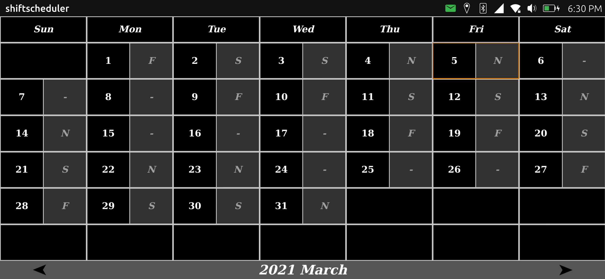
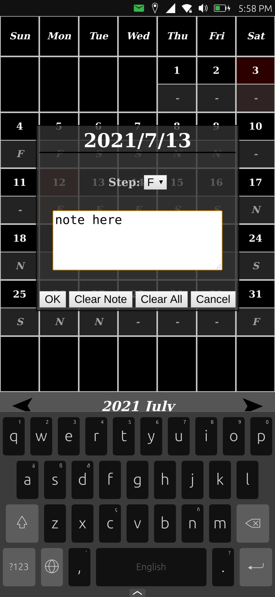
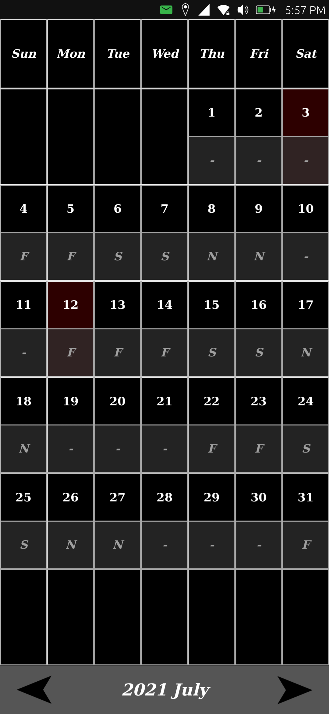

# Shift Scheduler

## How it Works
Uses pypy (python3.7) as interpreter to run a flask server and start a webview<br/>
(`webapp-container http://localhost:port/`).<br/>
> The flask server port is set to 0

  * Tested Devices:
    * Volla Phone
  * Arch: aarch64

  > prepared pypy package: [pypy-aarch64.tar.gz](dist/pypy-aarch64.tar.gz)<br/>
  > see: *https://www.pypy.org/*<br/>
  > see: *https://www.pypy.org/download.html*

## Install libssl.so.1.1 & python3.9

Install dependencies
```bash
sudo apt install build-essential gcc git zlib1g zlib1g-dev
```

### missing libssl.so.1.1: (will occur if you try to install somethings via pip)

```bash
# Download libssl1.1 (openssl)
wget https://www.openssl.org/source/openssl-1.1.1.tar.gz
# extract deb package
tar -xvzf openssl-1.1.1.tar.gz
cd openssl-1.1.1/
./Configure linux-aarch64 --prefix=/usr/local/ssl --openssldir=/usr/local/ssl shared zlib
make

# just link files to /lib
sudo ln -s libcrypto.so libcrypto.so.1.1 libssl.so libssl.so.1.1 /lib/

# reboot
sudo reboot
```

### Python3.9 (from source)

```bash
git clone -b 3.9 https://github.com/python/cpython.git
cd cpython

# check if you are in the 3.9 branch
git branch

./configure --prefix /usr/local/
make
sudo make altinstall

# check
python3.9 --version
python3.9 -m pip --version
```


## Install python Dependencies

* flask
```bash
python3.9 -m pip install flask
```

## Install click package

1. adb: run `clickable` command inside the ubports directory (connect phone to pc before)
2. ssh: `clickable --ssh <ip>`
3. prepared package [here](dist/) (for install from phone)


## Screenshots
</img><br/>
</img>
</img>


## License

Copyright (C) 2021  Udo Bauer

This program is free software: you can redistribute it and/or modify it under the terms of the GNU General Public License version 3, as published
by the Free Software Foundation.

This program is distributed in the hope that it will be useful, but WITHOUT ANY WARRANTY; without even the implied warranties of MERCHANTABILITY, SATISFACTORY QUALITY, or FITNESS FOR A PARTICULAR PURPOSE.  See the GNU General Public License for more details.

You should have received a copy of the GNU General Public License along with this program.  If not, see <http://www.gnu.org/licenses/>.
